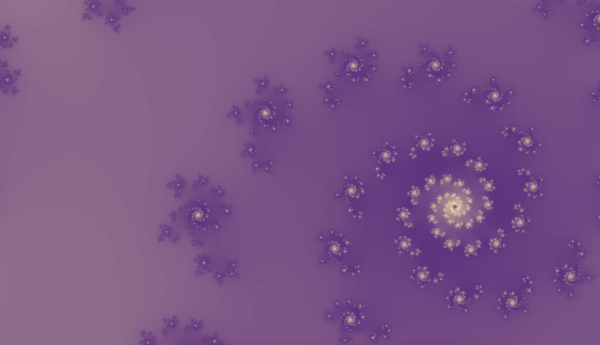

**Фракта́л** (лат. fractus — дроблёный, сломанный, разбитый) — множество, обладающее свойством самоподобия 
(объект, в точности или приближённо совпадающий с частью себя самого, то есть целое имеет ту же форму,
что и одна или более частей). В математике под фракталами понимают множества точек в евклидовом пространстве, 
имеющие дробную метрическую размерность (в смысле Минковского или Хаусдорфа), либо метрическую размерность, 
отличную от топологической, поэтому их следует отличать от прочих геометрических фигур, ограниченных конечным 
числом звеньев. Самоподобные фигуры, повторяющиеся конечное число раз, называются предфракталами.

В этом проекте использована графическая библиотека MLX.
Проект собран в сотрудничестве с Kain2250.

    Для запуска:
    $> make
    $> ./fraktol mand
    
    
Без проблем собирается на Mac OS Mojave, в Linux возможно надо будет поправить путь до MLX в Makefile.

